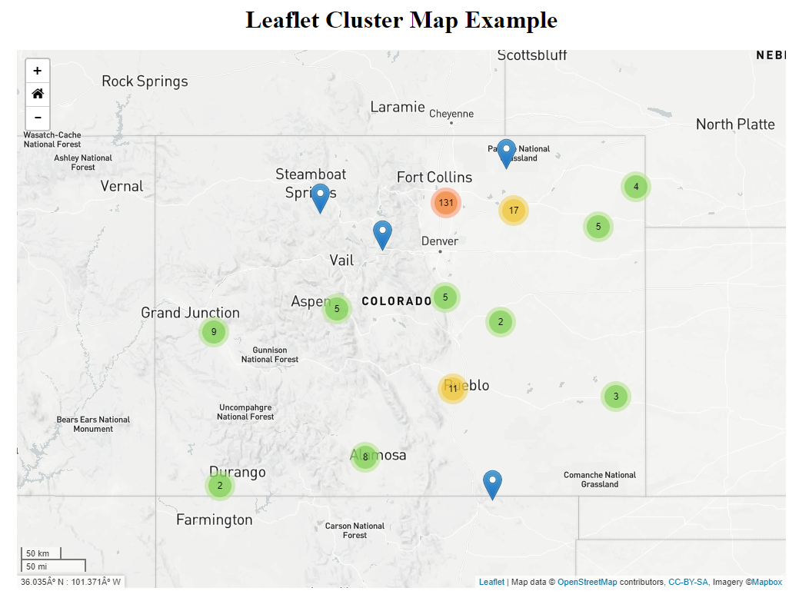

## Cluster-Map
<a href="http://github.openwaterfoundation.org/owf-lib-viz-leaflet-js/Cluster-Map/site/"><b>See a Live Demo of this Example</b></a>

While this map is zoomed out, the points are grouped into clusters with the number of points in the cluster displayed on it. When the map is zoomed in the clusters 
break up into individual points. This makes it easier to see the points on the map at any zoom level.