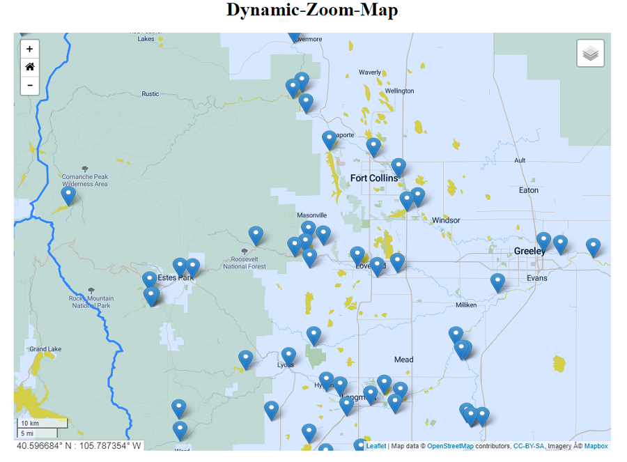

## Dynamic-Zoom-Map
<a href="http://github.openwaterfoundation.org/owf-lib-viz-leaflet-js/Dynamic-Zoom-Map/site/"><b>See a Live Demo of this Example</b></a>

This map features icons that update based on the map's zoom level.  When the map is zoomed further out, the icons become smaller to avoid stacking on top of each other and cluttering the screen.
