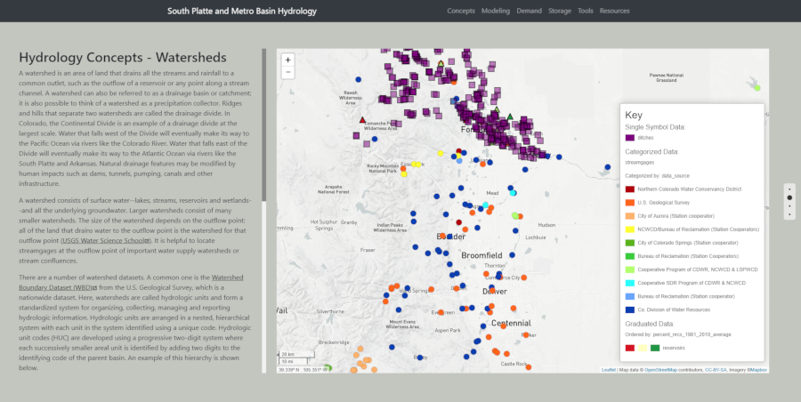

<a href="http://github.openwaterfoundation.org/owf-lib-viz-leaflet-js/Leaflet-Story/site/"><b>See a Live Demo of this Example</b></a>



An example of a story with multiple leaflet maps created from a JSON configuration file, geoJSON data, and the javascript file `js/map-files/leaflet-symbol.js` that creates the maps.

HTML code that creates the map:

````
<div class="col-lg-8">
    <div id="mapbox6" class="map-right"></div>
    <script>
      setJsonFile("data/point_layers_2019-05-15.json");
      setId("mapbox6");
    </script>
<script src="js/map-files/leaflet-symbol.js"></script>
````

To create a map:
1. give the map a unique id. In this example it is mapbo6.
2. call setJsonFile() with the path to the json configuration file. In this case, "data/point_layers_2019-05-15.json"
3. call setId() with the unique id created earlier.
4. include the leaflet map file "js/map-files/leaflet-symbol.js". This file will not change for each map.