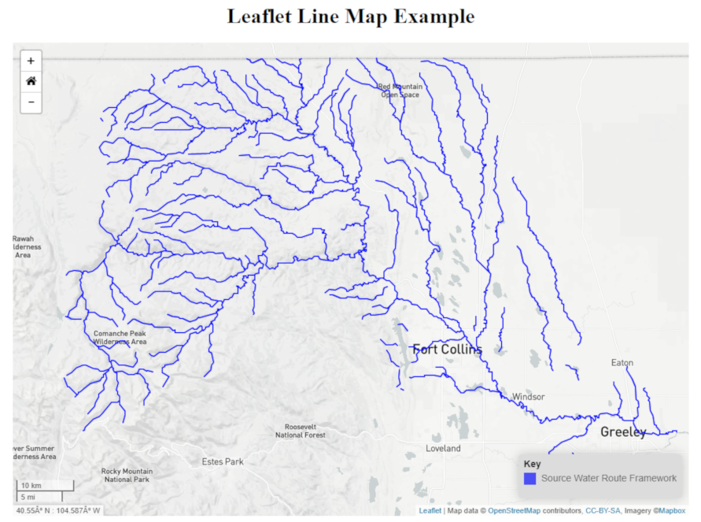

## Line-Map
<a href="http://github.openwaterfoundation.org/owf-lib-viz-leaflet-js/Line-Map/site/"><b>See a Live Demo of this Example</b></a>



This map uses a .json format file and a .geojson file to create line data on a map.

In the .json file the property "symbol" determines how the data should be displayed. 
The .geojson file contains the actual data. Here is an example of the format of the .json file:
```
"properties": {...}
"layers": [
    {
        geolayerId: "",
        name: "",
        ...
    }
    ...
]
"layerViewGroups": [
    {
        "name": "",
        "description": "",
        "layerVews": [
            {
                "layerId": "",
                "displayName": "",
                "symbol": {
                    "classification": "singleSymbol",
                    "classificationField": "",
                    "color": "blue",
                    "outlineColor": "",
                    "size": "",
                    "sizeUnits": "pixels",
                    "marker": "",
                    "opacity": 1.0,
                    "lineWidth": 2,
                    "linePattern": "",
                    "fillPattern": "",
                    "fillOpacity": 1.0
                }
            }
        ]
    }
]
```