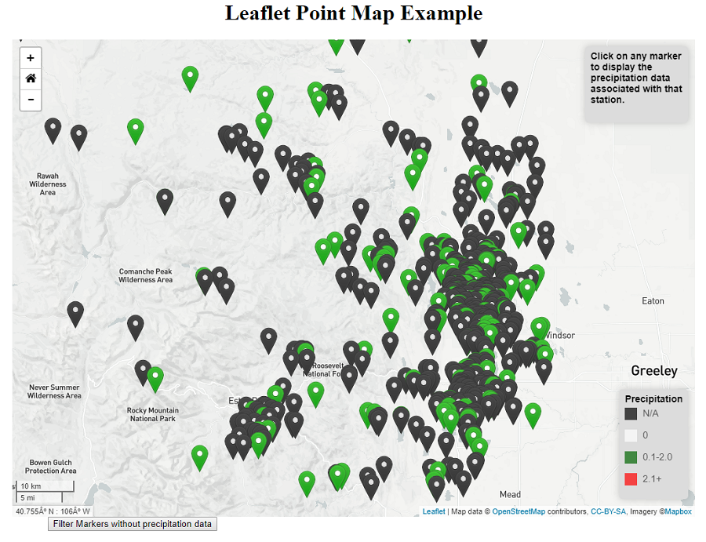

## Point-Map

Point Maps are a way of detecting spatial patterns or the distribution of data over a geographical region, by placing equally sized points over a geographical region.

There are two types of Point Map: one-to-one (one point represents a single count or object) and one-to-many (one point represents a particular unit, e.g. 1 point = 10 trees).

Point Maps are ideal for seeing how things are distributed over a geographical region and can reveal patterns when the points cluster on the map. Point Maps are easy to grasp and are better at giving an overview of the data, but are not great for retrieving exact values.

For more information refer to the link below:

* [Point Map](http://www.datavizcatalogue.com/methods/dot_map.html)
