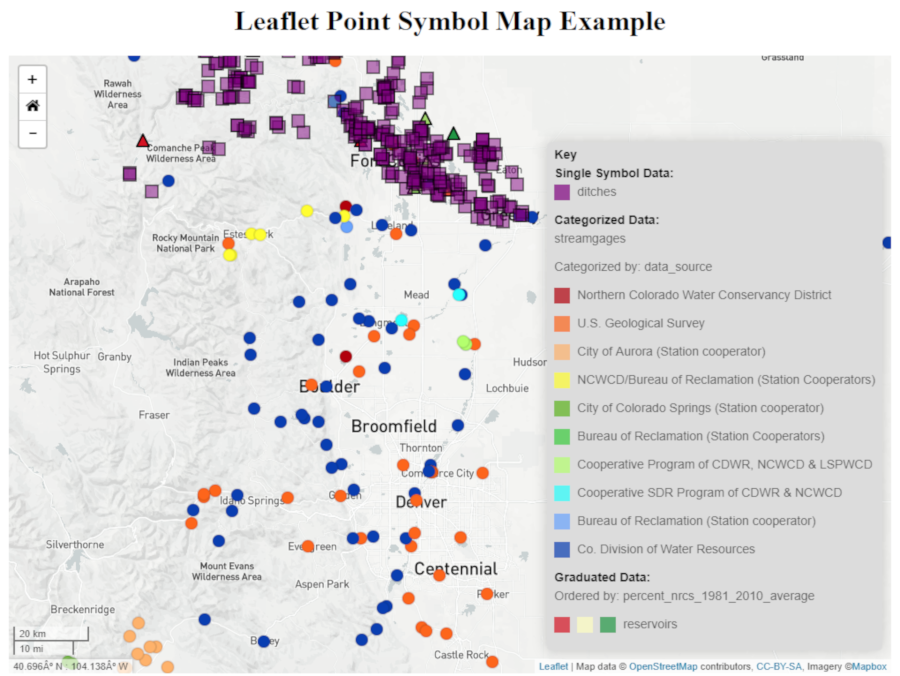

## Point-Symbol-Map
<a href="http://github.openwaterfoundation.org/owf-lib-viz-leaflet-js/Point-Symbol-Map/site/"><b>See a Live Demo of this Example</b></a>



Instead of the traditional icons this map uses shapes to represent points. The shape, color, and size can be changed.

This map uses a .json format file and a .geojson file to create point data on a map.

In the .json file the property "symbol" determines how the data should be displayed. 
The .geojson file contains the actual data. Here is an example of the format of the .json file:
```
"properties": {...}
"layers": [
    {
        geolayerId: "",
        name: "",
        ...
    }
    ...
]
"layerViewGroups": [
    {
        "name": "",
        "description": "",
        "layerVews": [
            {
                "layerId": "",
                "displayName": "",
                "symbol": {
                    "classification": "categorized",
                    "classificationField": "Data_Source",
                    "color": "Spectral",
                    "outlineColor": "",
                    "size": 7,
                    "sizeUnits": "pixels",
                    "marker": "circle",
                    "opacity": 1.0,
                    "lineWidth": "",
                    "linePattern": "",
                    "fillPattern": "",
                    "fillOpacity": 1.0
                }
            }
        ]
    }
]
```

Point Maps are a way of detecting spatial patterns or the distribution of data over a geographical region, by placing equally sized points over a geographical region.

There are two types of Point Map: one-to-one (one point represents a single count or object) and one-to-many (one point represents a particular unit, e.g. 1 point = 10 trees).

Point Maps are ideal for seeing how things are distributed over a geographical region and can reveal patterns when the points cluster on the map. Point Maps are easy to grasp and are better at giving an overview of the data, but are not great for retrieving exact values.

For more information refer to the link below:

* [Point Map](http://www.datavizcatalogue.com/methods/dot_map.html)
