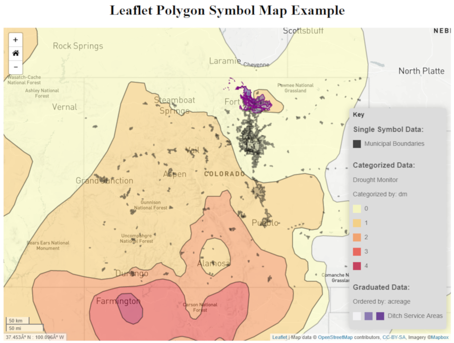

## Polygon-Symbol-Map
<a href="http://github.openwaterfoundation.org/owf-lib-viz-leaflet-js/Polygon-Symbol-Map/site/"><b>See a Live Demo of this Example</b></a>

<a href="http://github.openwaterfoundation.org/owf-lib-viz-leaflet-js/Polygon-Symbol-Map/site/javascript/out"><b>See the JSdoc</b></a>



This map uses [polygon_layers_2019-05-15.json](http://github.openwaterfoundation.org/owf-lib-viz-leaflet-js/Polygon-Symbol-Map/site/maps/polygon_layers_2019-05-15.json) as a format file and [ditchserviceareas-district-3.geojson](http://github.openwaterfoundation.org/owf-lib-viz-leaflet-js/Polygon-Symbol-Map/site/maps/polygon-layers-map/ditchserviceareas-district03.geojson), [drought-monitor.geojson](http://github.openwaterfoundation.org/owf-lib-viz-leaflet-js/Polygon-Symbol-Map/site/maps/polygon-layers-map/drought-monitor.geojson), and [municipal-boundaries.geojson](http://github.openwaterfoundation.org/owf-lib-viz-leaflet-js/Polygon-Symbol-Map/site/maps/polygon-layers-map/municipal-boundaries.geojson) as data files to create polygon data on a map.

In [polygon_layers_2019-05-15.json](http://github.openwaterfoundation.org/owf-lib-viz-leaflet-js/Polygon-Symbol-Map/site/maps/polygon_layers_2019-05-15.json) the property "symbol" determines how the data should be displayed. Here is an example of the format of the .json file:
```
"properties": {...}
"layers": [
    {
        geolayerId: "",
        name: "",
        ...
    }
    ...
]
"layerViewGroups": [
    {
        "name": "",
        "description": "",
        "layerVews": [
            {
                "layerId": "",
                "displayName": "",
                "symbol": {
                    "classification": "graduated",
                    "classificationField": "ACREAGE",
                    "color": "",
                    "colorRamp": "Greens",
                    "colorRampMin": "0",
                    "colorRampMax": "85631",
                    "colorTable": "",
                    "fillOpacity": 0.5,
                    "fillPattern": "",
                    "lineCap": "square",
                    "lineJoin": "square",
                    "linePattern": "",
                    "lineWidth": "2",
                    "marker": "",
                    "opacity": 0.8,
                    "outlineColor": "green",
                    "popupMouseover": "false",
                    "popupSource": "DITCH_NAME",
                    "size": "",
                    "sizeUnits": "pixels"
                }
            }
        ]
    }
]
```
For each polygon a geoJson layer is created. The geoJson layer has a style feature which has the attributes weight, opacity, color, ect. as shown below.
```
let boundariesLayer = L.geoJSON(data, {
    weight: layer_weight,
    opacity: layer_opacity,
    color: layer_color,
    fillOpacity: layer_fillOpacity,
    fillColor: getColor(feature['properties'][layer_classificationField]),
    dashArray: layer_dashArray,
    lineCap: layer_lineCap,
    lineJoin: layer_lineJoin,
}).addTo(map);
```
The table shows how the [polygon_layers_2019-05-15.json](http://github.openwaterfoundation.org/owf-lib-viz-leaflet-js/Polygon-Symbol-Map/site/maps/polygon_layers_2019-05-15.json) file symbol properties are mapped to the leaflet properties.

| Map Configuration Symbol Property | Leaflet Symbol Property | Comments |
| --------------------------------- | ----------------------- | -------- |
| classification | layer_classification | Describes the way color should be applied to the data. There are three options: 'singleSymbol': data is represented with one color, use the 'color' field to determine fill color. 'categorized': data is classified into groups based on the classificationField and each assigned to a color, use the 'colorTable' field to determine fill color. 'graduated': data is shown in different shades of a color based on values obtained from classificationField, use the 'colorRamp' field  to determine fill color. Default is 'singleSymbol'. |
| classificationField | layer_classificationField | The field in the geojson file that should be used to categorize the data for a colorTable or a colorRamp. |
| color | Set fillColor in the style function for the desired layer | The color of the inside of the shape. Used for symbols classified as 'singleSymbol'. Input color as a name 'blue' ([supported color names](https://www.w3schools.com/colors/colors_names.asp)), a hex color '#ff0000', or a rgb value 'rgb(255,0,0)'. Default is 'blue'. |
| colorRamp | layer_colorRamp | For data classified as 'graduated'. Data will be shown in different shades depending on the value in the classificationField. Input colorRamp as a name ('Blues', 'Greens', 'Inferno'...). Any color ramps avaliable in QGIS are supported. Or input can be a list of colors {color1}{color2}{color3}... with a minimum of two colors. |
| colorRampMax | layer_colorRampMax | For data classified as 'graduated'. Used as the maximum value in the colorRamp and represented by the last color in the colorRamp. Default is 0. |
| colorRampMin | layer_colorRampMin | For data classified as 'graduated'. Used as the minimum value in the colorRamp and represented by the first color in the colorRamp. Default is 100. |
| colorTable | layer_colorTable | For data classified as 'categorized'. Data is classified into groups based on the classificationField and each assigned to a different color. Input values and colors as {value1}{color1}{value2} |
| fillOpacity | Set opacity in the style function for the desired layer | The opacity of the inside of the shape. Default is 0.1. |
| fillPattern | | Not implemented in leaflet. |
| lineCap | Set lineCap in the style function for the desired layer | A string that defines the shape to be used at the end of the stroke. Default is 'round'. |
| lineJoin | Set lineJoin in the style function for the desired layer | A string that defines the shape to be used at the end of the stroke. Default is 'round'. |
| linePattern | Set dashArray in the style function for the desired layer | Option for dahsed line. Doesn't work on Canvas powered layers in some old browsers. Example formats: '20, 10', '20', '30, 5, 10'. The first number is the length of the first dash. The second number is the length of the first space and so on. Default is null. |
| lineWidth | Set weight in the style function for the desired layer | The outline width in pixels. Default is 2. |
| marker | | Not implemented for polygons in leaflet. |
| opacity | Set opacity in the style function for the desired layer | The opacity of the outline. The default is 1. |
| outlineColor | Set color in the style function for the desired layer | The color of the outline. Input color as a name 'red' ([supported color names](https://www.w3schools.com/colors/colors_names.asp)), a hex color '#ff0000', or a rgb value 'rgb(255,0,0)'. The default is blue. |
| popupSource | bindPopup() | A string contatining that geoJSON property name that should be accessed and displayed in the popup. Default is empty string, "" |
| popupMouseover | marker.on('mouseover', function(e){...} ) | Boolean value, if true popups will be triggered on mouseover. If false popups will be triggered on click. Default is false. |
| size | | Not implemented for polygons in leaflet. |
| sizeUnits | | The default is pixels. |
| | Set stroke in the style function for the desired layer | A boolean value, set to false to disable borders on polygons. Not implemented in configuration file. Default is true. |