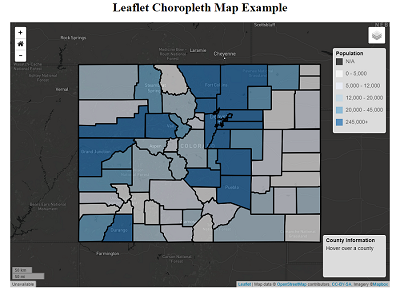
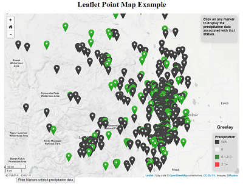
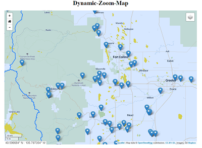
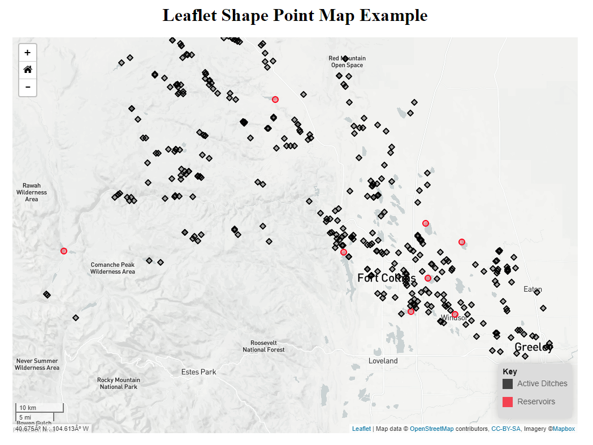
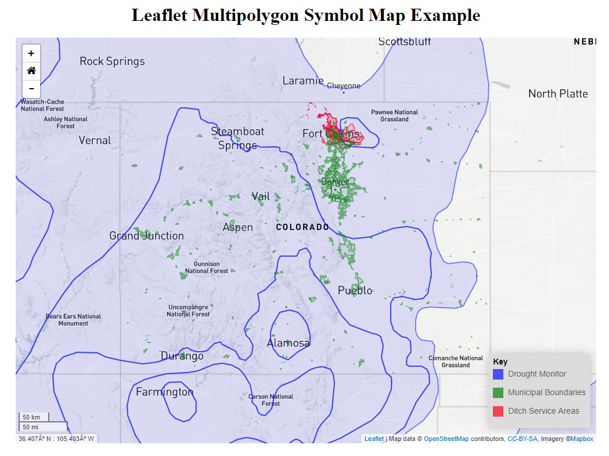

# owf-lib-viz-leaflet-js
Open Water Foundation JavaScript visualization library based on Leaflet

### Table of Contents
The repository contains multiple folders that contain examples of each type of visualization.

| Preview Link | Description |
|---------|-------------------------------------------------------------------------|
|<center>**[Choropleth-Map](Choropleth-Map)**<center><br>[](Choropleth-Map)| Choropleth Maps display divided geographical areas or regions that are colored, shaded, or patterned in relation to a data variable.                             |
|<center>**[Heat-Map](Heat-Map)**<center><br>[](Heat-Map)| Heatmaps visualize data through variations in coloring.                             |
|<center>**[Point-Map](Point-Map)**<center><br>[](Point-Map)| Point Maps are a way of detecting spatial patterns or the distribution of data over a geographical region.           |
|<center>**[Dynamic-Zoom-Map](Dynamic-Zoom-Map)**<center><br>[](Dynamic-Zoom-Map)| This map features icons that update based on the map's zoom level.             |
|<center>**[Cluster-Map](Cluster-Map)**<center><br>[](Cluster-Map)| This map clusters together icons when zoomed out.     |
|<center>**[Shape-Point-Map](Shape-Point-Map)**<center><br>[](Shape-Point-Map)| This map has customizable shapes instead of traditional icons.     |
|<center>**[Multipolygon-Symbol-Map](Multipolygon-Symbol-Map)**<center><br>[](Multipolygon-Symbol-Map)| This map shows how to display geoJSON multipolygons.     |
|<center>**[Line-Map](Line-Map)**<center><br>[](Line-Map)| This map shows how to display geoJSON lines.     |


## Getting Started

A standard development folder structure is recommended. The website development files can be set up as follows (Windows is assumed, but linux would be similar):

```
> C:
> cd \Users\user
> mkdir Leaflet-js
> cd Leaflet-js
> mkdir git-repos
> cd git-repos
> git clone https://github.com/OpenWaterFoundation/owf-lib-viz-leaflet-js
```

## Sign Up For Mapbox and Create A New Style

If you do not have a free Mapbox account, create one by going to the [Account Creation](https://www.mapbox.com/signup/) page. Once you have created a Mapbox account, go to the [Mapbox Studio](https://www.mapbox.com/studio/) page. Click on the **styles** tab on the left hand side of the screen. Select the purple **New Style** button in the top right corner of the screen. Once selected, leave the selected style as the default selection and give your style a unique name. For this example let's call it TutorialStyle. Once the style has been created, Mapbox should have redirected your webpage to a map of the world. In this view you can edit your map and customize it to look however you want. For further documentation on editing a map refer to the link below:

[Edit Map Documentation](https://www.mapbox.com/help/studio-manual-styles/)

Now click on the **Style** tab again and select the 3 lined bar tab next to the style you just created. Once selected, a popup should display. Select the **Share, develop & use** option. There should be an option now that says Develp with this style. Select the leaflet tab and than you can copy that link into your leaflet map.

## Additional Documentation

Leaflet is an open source web mapping library that forms the basis of Mapbox.js. It is software that works on web pages and makes interactive maps possible. Leaflet requests tiles from servers like Mapbox, displays and animates them, and supports other overlays.

See also:
* [Leaflet Documentation](http://leafletjs.com/reference.html)
* [Mapbox Documentation](https://www.mapbox.com/help/)
